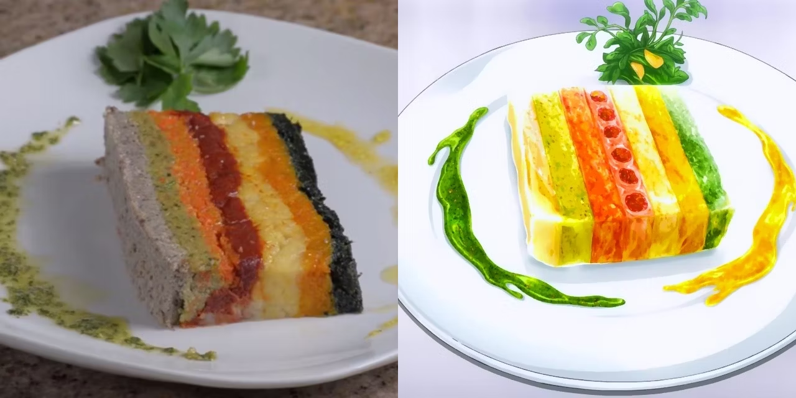

# Regegenbogen Terrine

---

## Zutatenliste

### Terrine:
- 3 Kartoffeln
- 150 g shiitake Pilze
- 220 g Geflügelhack
- 2 Karotten
- 7 Msp. Salz/Pfeffer/Piment
- 7 Eier
- 300 ml Schlagsahne
- ½ Kleiner Kürbis
- 110 g Rinderhack
- 1 Zucchini
- 50 g Thunfisch
- 200 g Spinat
- 100 g Tomatenmark
- 4 Kirschtomaten
- 4 getrocknete Tomaten
- 2 EL Olivenöl

### Basilikumpesto:
- 6 Walnüsse
- 1 Hand Petersilie
- 1 Hand Basilikum 
- ½ Limette
- 50 g Pinienkerne 
- 100 ml Olivenöl

### Frische Soße:
- ¼ TL Senf
- ¼ Zitrone
- Etwas bunten Pfeffer
- ½ EL Honig
- 1EL Olivenöl

---
## [clicking here for youtube tutorial](https://youtu.be/-U9mimTLbDo?feature=shared)

---

 Regenbogenterrine

Ist ein sehr aufwendiges Rezept

